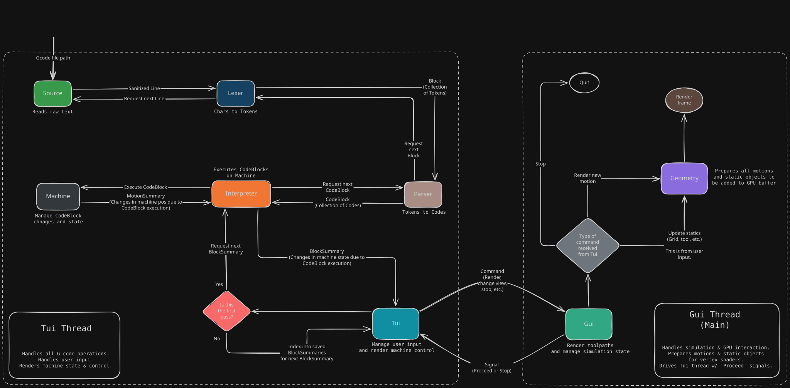

# GSim-RS

A G-code simulator written in Rust.
Parses, interprets, manages machine state and simulates the toolpaths.
The control interface is built in **Ratatui** and the simulation is done using **WGPU**.

 

## Architecture

*I am not big on system diagrams for personal projects,
but I feel like this one warrants one as there are **A LOT** of moving parts.*

## Motivation
